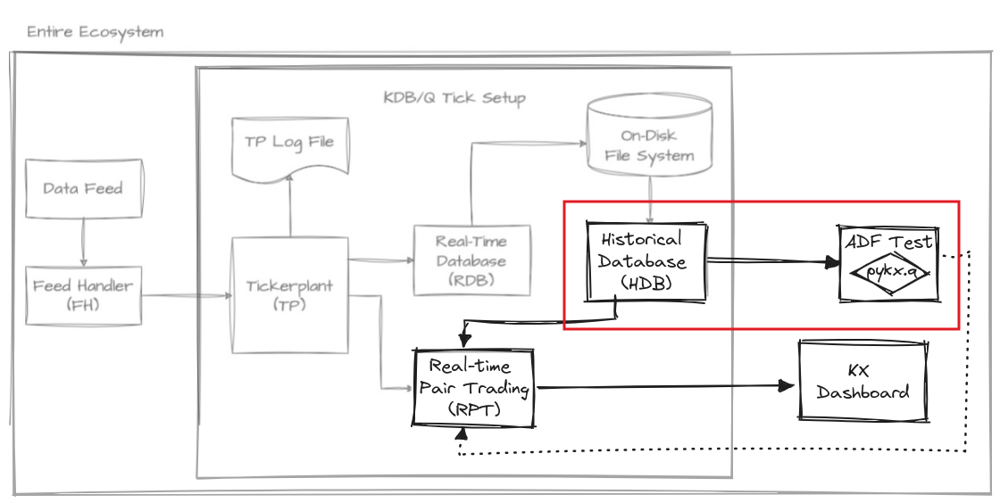
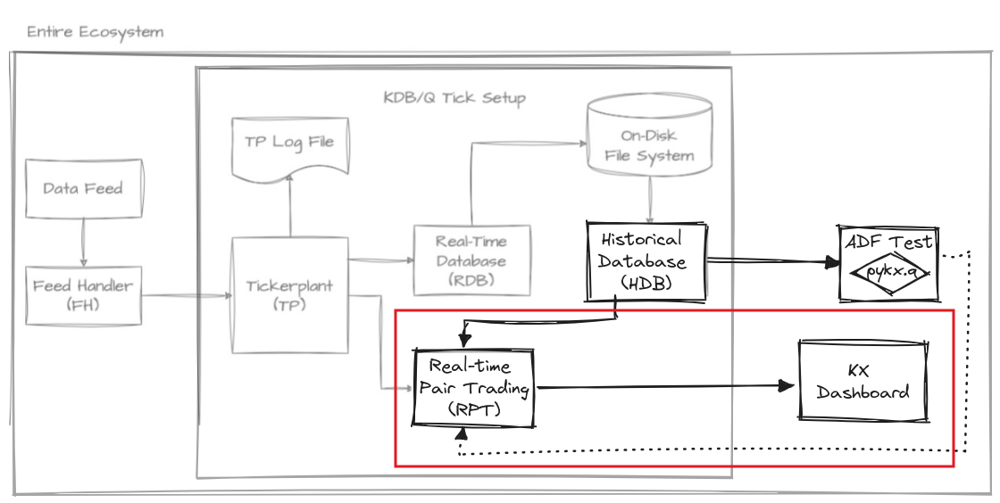

# A Match Made in Trading: Step-by-Step Pairs Trading Guide

KDB+/Q stands out as **a powerful tool in finance**, renowned for its ability to handle vast volumes of real-time data amidst the relentless dynamics of the market. In this article, we embark on an insightful exploration of _Pairs Trading_, one of the most popular strategies in the trading world, and its implementation in Q.

In order to achieve this, we have outlined the following steps:
* Identifying cointegrated indexes, i.e., related pairs
* Implementing a model to calculate their spreads
* Visualizing the approach in real-time

We will use the [_Tick Architecture_](https://github.com/KxSystems/kdb-tick), the typical setup found in kdb+ systems, to introduce, contextualize and guide each step. As we acknowledge that the typical reader is a quant interested in learning the virtues of q, a concise introduction to this architecture will be provided. We have also aimed to briefly introduce pairs trading so that other developers can follow and benefit from this text. Please, feel free to skip the following section if you are familiar with it.

## What is Pairs Trading?

The market has often been described as a **stochastic** (a term which essentially means random) **process** where prices fluctuate irregularly. However, amidst this apparent randomness, we observe that **certain assets move in tandem** due to their inherent relationships. 

For instance, it's logical to expect that if the prices of petrol rise, the prices of cars should also rise. This is because auto companies rely on petrol for their operations, indicating an interconnectedness between the two. Over the long run, they tend to follow similar trends, **reflecting their underlying relationship**.

Is this described mathematically? **Yes**:

The concept we're referring to is **cointegration** (although there are other methods, we'll focus on this one).

> 💡 Which should not be confused with correlation; cointegration is a statistical property of two-time series, indicating a long-term relationship between them despite short-term fluctuations. Cointegrated series move together over time, sharing a common stochastic drift. On the other hand, correlation measures the strength and direction of the linear relationship between two variables at a specific point in time. While correlation captures the degree of association between variables, cointegration reflects a deeper, underlying relationship that persists over time.

Hence, we're interested in **cointegrated assets**, which are assets that exhibit the following characteristics:
* They have a similar trend, meaning the difference between both assets maintains a constant mean, and this difference fluctuates around that same mean.
* This inherent relationship persists in the long run, meaning that our series is not dependent on time.

Before diving into this search for cointegrated pairs, let me introduce you the tick architecture.

## What is the Tick Architecture?

The tick architecture is designed to handle high-frequency trading data efficiently. At its heart is the tickerplant (TP), a crucial component responsible for receiving and timestamping incoming data, then broadcasting it to other components such as the real-time database (RDB) and historical database (HDB). The TP ensures that data is distributed in a timely manner, allowing for real-time analytics and decision-making. The RDB stores recent data for quick access, while the HDB archives older data for long-term storage and analysis. Additionally, the feedhandler plays a vital role by interfacing with external data sources, making sure that the TP receives accurate and up-to-date information. This architecture guarantees seamless data flow and rapid access to both real-time and historical data, making it ideal for high-frequency trading applications.


To develop the pair trading strategy, we have added a couple of new components to the default vanilla architecture: ADF Test, Real-time Pair Trading (RPT) and KX Dashboard. They will be introduced as required. So finally, let's move on to the very first step of this journey: finding cointegrated pairs.

## Identifying cointegrated indexes

Let's focus on the ADF Test component. It reads data from the HDB and provides the means for the quant to determine a cointegrated pair as output, which will then be supplied as input for further steps.



Let's move on to the code we need to implement it.


Imagine **we selected 13 world indexes** and aimed to assess whether they are **cointegrated** among them or not. In KDB+/Q we can start by declaring a variable containing every index and generating the cartesian product (`cross`) of this indexes.

```q
syms:`SP500`NASDAQ100`BFX`FCHI`GDAXI`HSI`KS11`MXX`N100`N225`NYA`RUT`STOXX
pairs: syms cross syms
```

In this scenario, a crucial tool at our disposal is the Augmented Dickey-Fuller (ADF) test, an essential statistical test for assessing the stationarity of time series data. The more stationary the time series are, the more cointegrated they are likely to be.

This statistical test is a **hypothesis test**, where we use our data to see if we can accept or reject a hypothesis. In our case, the hypothesis is whether the time series is non-stationary. To determine this, we use **p-values**.

**P-values** help us decide whether to reject the null hypothesis. If the p-value is low, it indicates that we can reject the hypothesis that the time series is non-stationary, suggesting that our assets are cointegrated. The lower the p-value, the greater the confidence in rejecting the null hypothesis. It is very common to use a threshold of 0.05 on the p-value to reject hypotheses.

For the sake of simplicity, we will be using [PyKX](https://code.kx.com/pykx/2.4/index.html). This is necessary as we require importing our ADF test function and plotting a heatmap of our results. Developing these functionalities directly in Q would be time-consuming and prone to errors. Although an implementation of the ADF test in KDB+/Q would be more efficient and faster, the effort required would outweigh the benefits for this particular case where performance isn't critical. Therefore, we rely on PyKX to streamline the process by leveraging relevant libraries from the Python ecosystem.

```q
system"l pykx.q"
```

One such library is **statsmodels**, a prominent tool in Python for statistical modeling and hypothesis testing. It equips analysts with a robust toolkit for regression, time series, and multivariate analysis. Specifically, within the **statsmodels** package, the **statsmodels.tsa.stattools** module features **the Augmented Dickey-Fuller (ADF) test**.

We can proceed to create a function called **fcoint** to call our imported function from PyKX, handle any null values by filling them with 0, using `0f^` and return the second value, which in this case is the p-value.

```q
coint:.pykx.import[`statsmodels.tsa.stattools]`:coint
fcoint:{@[;1]0f^coint[x;y]`}
```

As we saw in the introduction, we are working in a tick architecture environment. This means that, in addition to receiving real-time prices for our indices, this architecture provides a tool to store the closing prices of our indices in our HDB at the end of the day. As obvious, establishing a connection with HDB is required:
```q
hdb:hopen port
```
As can be seen, we assume that the HDB process is listening at a given `port` in the local machine. We just `hopen` a connection with it and get the `hdb` handle.

Then, we define the query that we want the HDB to run. In this case, we declare `rs`, which takes the (n)umber of historic days and the involved (sym)bol(s) for which we want to retrieve data, as arguments.

```q
rs:{[n;syms]select from prices where date within (.z.d-tr;.z.d),sym in syms}
```
The body of the function might seem pretty familiar to the SQL practicioner. In fact, we are exploiting **qSQL syntax** here, which leverages a syntax similar to SQL but optimised for kdb+. It is also worth noting that `.z.d` represents the current date, so we are interested in retrieving data from the `n` days back from today.

Now we need to send this function along with the necessary arguments to the HDB. This approach exemplifies a good practice in kdb+: keeping computations as close to the data as possible. Instead of requesting data and then applying a computation to it, we send the computation to the HDB itself so we avoid transmitting unnecessary data over the communication.
```q
t:`sym xgroup hdb(query_prices;4*365;syms)
```
To communicate with the process, we pass a list to the `hdb` handle with the first element being the function and the subsequent elements being the arguments (last 4 years & involved indexes). Once we get our data we finally `xgroup` by index.

> 💡 Once we have finished our communication with another process, we should close the connection, as in `hclose hdb`.

In our case, we are going to use closing prices to feed the ADF test, so we have to index (`@`) by column **close** from each pair in our table. Additionally, we take (`#`) the last **tr** days of data for both indexes, and finally apply our **fcoint** function to each (`.'`) pair of data lists.
```q
matrix:fcoint .' 0f^@\:[;`close](@/:[t]') pairs
```

Now, with our matrix in hand, we can plot it and **visually identify** which asset is more favorable. In order to do that, we can leverage PyKX once again to bring the `heatmap` module from `seaborn` a prominent data visualization library in the Python ecosystem to q:

> 💡 We could have created a dashboard to plot the heatmap using KX Dashboard, but in this case, it is simpler and faster to use PyKX and plot as we would in Python, with minor modifications to the syntax.

```q
pyhm:.pykx.import[`seaborn]`:heatmap
pyhm[pvalues;`xticklabels pykw syms;`yticklabels pykw syms;`cmap pykw `RdYlGn_r]
```

And plot it:

```q
pyshow:.pykx.import[`matplotlib.pyplot]`:show
pyshow[::]
```

The resulting heatmap looks like this:


We will drawn our attention towards the **NASDAQ100* and **SP500** synergy. They exhibit a vibrant green colour, indicative of a high degree of cointegration, or, in simpler terms, a very low probability of not being cointegrated. They demonstrate low p-values suggesting their strength as candidates. This is no surprise since they both belong to the American market and share numerous characteristics.

 > 💡 As we can see, this pair of indexes is not the best candidate according to our ADF tests. However, we chose it because the detailed intraday tick data for their prices is publicly available (TickStory) which we will require for the real-time setting that we'll present later on.


The plotted graph displays the prices of both indexes together, providing a clearer comparison that showcases the cointegration between them. The blue and green lines represent SP500 and NASDAQ100, respectively. The close alignment of their price movements indicates that they are cointegrated to some extent. This means that, despite short-term deviations, the indices tend to move together as time goes on, maintaining a stable relationship. This graph was generated by [KX Dashboard](https://code.kx.com/dashboards/), which receives data from the Pairs Trading process and renders visualizations.

As mentioned earlier, the market is inherently random and doesn't always behave predictably. While NASDAQ100 and SP500 often follow similar trends, their individual values **can sometimes diverge significantly**. For instance, NASDAQ100 may rise while SP500 falls, or vice versa. 

However, this presents **an opportunity for profit** because we know that these assets tend to revert to their shared mean over time. If one asset is **overpriced** and likely to decrease, we may consider **selling it** (going short). Conversely, if an asset is **underpriced** and expected to increase, we may consider **buying it** (going long). That is what we call Pairs Trading.

> 💡 This strategy possesses financial characteristics: our **profitability remains unaffected by the broader market trends**, as our focus lies solely on the disparity between the two assets. It's about relative movements rather than absolute ones; we're indifferent to whether prices are rising or falling. This quality defines it as a **neutral market strategy**.

As you might guess, our next task is to build the model that helps us determine whether an index is actually overpriced or underpriced.

## Determining how to calculate the spreads

After this initial market assesment, we can move on to coding the actual Pair Trading model that calculates the spreads. The first approach we may try could simply be to subtract them and observe if the difference deviates significantly from zero, considering their scale difference.

Indeed, just subtracting the prices of two assets, as in $price_y−price_x$ may not provide a clear understanding of their relationship. Let's illustrate this with an example:

```q
q)price_x: 5 10 7 4 8
q)price_y: 23 30 25 30 35
q)spreads: price_y - price_x
18 20 18 26 27
```

**These spread values don't offer much insight** into the relationship between the two assets. Are both assets increasing? Are they moving in opposite directions? It's unclear from these numbers alone.


Let's consider **using logarithms**, as they possess favourable properties for our pricing model. They prevent negative values and stabilize variance. Log returns are time-additive and symmetric, simplifying the calculation and analysis of returns. This improves the accuracy of statistical models and ensures non-negative pricing, enhancing model robustness and reliability:

```q
q)log price_x
1.609438 2.302585 1.94591 1.386294 2.079442
q)log price_y
3.135494 3.401197 3.218876 3.401197 3.555348
q)spreads: log[price_y] - log price_x
1.526056 1.098612 1.272966 2.014903 1.475907
```

We're making progress, as we observe **numbers now fluctuating within much smaller ranges**. However, we're still missing a clear understanding of the underlying relationship. While we've normalized the data using logarithms, we now need to align their discrepancies to a single asset. 

Since both assets are related, **we can leverage linear regression** to our advantage. This enables us to simplify our spreads effectively. So, we'll conduct a basic linear regression analysis using historical data to discern the disparity between them. The generic formulae for one is:

$$Y = \alpha + \beta X + \varepsilon$$

In this context, Y represents the NASDAQ 100 index, X represents the S&P 500 index, α is the intercept, β is the slope (which indicates the relationship strength between the two indices), and ε is the error term.


The plotted graph above illustrates the relationship between the NASDAQ 100 and the S&P 500 indices, with each purple dot representing a data point of their prices at a given time. The linear trend visible in the scatter plot suggests a strong positive cointegration between the two indices. By applying linear regression, we can model this relationship mathematically, allowing us to predict the NASDAQ 100 index price based on the S&P 500 index price. This predictive power is crucial for pair trading, as it helps identify mispricings and potential trading opportunities.

Linear regression aims to identify relationships between historical data, which we then extrapolate to current data. The differences between these relationships, or deviations, are our spreads. We've already calculated the 𝛼 and 𝛽 using the logarithmic values of our historical data (since real-time price values for price_x and price_y are unknown). Now, we simply combine everything and apply linear regression to our price logarithms:

$$spread = log(price_y) - (\beta \cdot log(price_x)+\alpha)$$

```q
q)spreads: log[price_y] - alpha + log[price_x] * beta
-0.1493929 0.0451223 -0.08835117 0.0451223 0.1579725
```

There are different methods we can use to obtain the best alpha and beta values that minimize the spreads or, in other words, there are mathematical ways to find the line that best fits the prices.

The most common method to find the best relationships (alpha and beta) is the least squares method, which minimizes the sum of the squared residuals:
$$S(\alpha, \beta) = (log(priceY) - (\beta \cdot log(priceX)+\alpha)^2$$

After taking partial derivatives with respect beta and setting to zero, and then solving, we can arrive at this formula:

$$\beta = \frac{{(n \cdot \sum(x \cdot y)) - (\sum x \cdot \sum y)}}{{(n \cdot \sum(x^2)) - (\sum x)^2}}$$

Which we can see implemented in the following functions:

```q
betaF:{dot:{sum x*y};                                      
      ((n*dot[x;y])-(*/)(sum')(x;y))%                         
      ((n:count[x])*dot[x;x])-sum[x]xexp 2}
```

Now, following the same steps as before but for alpha, we arrive at:

$$\alpha = \bar y - \beta \cdot \bar x$$

Which is implemented in the following line of code:

```q
alphaF: {avg[y]-betaF[x;y]*avg[x]}
```

Finally, we can encapsulate both parameters in just one function called `lr_fit`. This function only has to apply each fit function to our input data.

```q
lr_fit:{(alphaF;betaF).\:(x;y)}
```

Now we simply need to apply `lr_fit` to find the optimal alpha and beta on the historical prices (which we took from HDB) of the indices we choose.

```q
params:lr_fit[t[`SP500]`close;t[`NASDAQ100]`close]
alpha_lr:params 0;beta_lr:params 1
```

This precisely meets one of our objectives: getting **a comprehensive method for representing relative changes between both assets**. As we can deduce, our mean is now 0 because our assets are normalized, cointegrated and on the same scale. Therefore, ideally, the differential between their prices should be 0. Consequently, when our spread is below 0, we infer that asset X is overpriced, whereas if it's above 0, then asset Y is overpriced.


## Real-time spread calculation

Now that we have selected a pair of cointegrated indices and built a model to calculate their relationships, it's time to formalize its subscription as a real-time component. Once we start receiving data from the TP, we can apply the model to produce the spreads, which will then be sent to the dashboard.




Real-time components can manifest their interest for a particular table and for a subset of symbols. As a result from previous steps, we know we are interested on the quotes for SP500 and NASDAQ100:
```q
tp"(.u.sub[`quote;`SP500`NASDAQ100])"
```
Assume that `tp` is just a handle to the TP process, similar to `hdb` from previous sections. Basically, what `.u.sub` does is registering the RPT handle in the TP so it can later notify the recently subscribed component about new events. To do so, it assumes that the subscriber has defined an `upd` function:
```q
upd:{.u.pub[`spread;([]time:1#y`time;spread:sp . y`bid)]};
```
This function essentially takes the current prices of _SP500_ and _NASDAQ100_ as input, calculates the spread, formats them as a table (along with the timestamp) and sends it to its subscribers by means of `.u.pub`. In this sense, the dashboard subscribes to the RPT using the same interface that the RPT uses to subscribe to the TP (`.u.sub`). However, in this case, the function is invoked automatically by the dashboard when a component selects the `spread` table from the RPT process as the source.
> We have adapted our feed handler so that it always publishes pairs of cointegrated ticks, in order to simplify the implementation of RPT.

We simply need to declare an `sp` function that calculates the spread given the prices, but this is something we already know how to do.

```q
sp:{y - alpha_lr + beta_lr * x};
```

By using this approach, we only need to connect KX Dashboards to our publisher by setting up a new connection from the connection selector in the UI.
This will allow us to plot our spreads in real time and we will end up with something like this:


And there we have it! **A perfectly plotted spread series in real-time**, ready to be utilized for further analysis and exploitation.

Up until this point in this section, we have taken a look at how we, having previously identified a pair of compatible assets, could reliably calculate a meaningful spread and implemented it in a simulated real-time scenario. Thanks to KX Dashboards we were also able to create a simple plot to show all this information in a way that's easily understandable.

To finish, once we have our spreads accurately calculated and observe how our data is being updated we can **execute buy and sell orders when spread discrepancies occur** based on some signal windows.

A simple approach to window signals is to set these windows as twice the historical standard deviation of the spreads. Therefore, if either of these limits is reached, we should sell the overvalued index and buy the undervalued one, and then unwind our position when the spread returns to 0. Let's clarify this with a specific example:


In this instance, we can see that the spread (purple line) is positive and above the signal (blue line), indicating that our Y index (NASDAQ100) is overvalued relative to the SP500. Therefore, we should sell NASDAQ100 and buy SP500. At the end of the gif, it can be observed that the spread returns to 0 (green line), meaning the indexes are no longer overvalued or undervalued, respectively. At this point, we should unwind the positions we acquired earlier.

> 💡 Signal windows play a pivotal role in implementing Pairs Trading strategies. They serve as indicators for determining when to execute buy and sell actions, acting as arbitrary thresholds that guide our algorithm's decision-making process. These windows are derived from the variance of our data, representing a static variance assumption due to our consideration of a time-independent cointegrated series.

## Conclusion

In this post, we have provided a comprehensive overview of the implementation of the Pairs Trading strategy in KDB+/Q, contextualized within the Tick Architecture. Here are some key takeaways:
* The Tick Architecture allows us to handle both historical and real-time data.
* By leveraging historical data, we were able to easily identify cointegrated pairs, reusing libraries from the Python ecosystem via PyKX when needed.
* Q is very expressive and the implementation of the Linear Regression logic for producing the spread model is straightforward.
* Integrating a real-time component and connecting it with a dashboard is simple and efficient.

More generally, and although we couldn't delve into all the details in this post, we'd like to emphasize the three major selling points of KDB+/Q. First, it can process large amounts of data in a very short time with a small memory footprint, allowing us to monitor thousands of pairs simultaneously. Secondly, Q code is highly concise, enabling us to implement all the components in the diagram in less than 100 lines of code. Finally, the technology is highly flexible, allowing us to easily adapt to other scenarios beyond Pairs Trading.

## Future Work

One valid concern is that our calculations might be heavily influenced by past data and rely too much on historical changes that may not accurately reflect the present reality. To address this, we could implement a rolling window approach where the linear regression is continuously updated, ensuring our model remains responsive to changes in the underlying data over time. Additionally, using the Kalman Filter to dynamically fit the alpha and beta of the linear regression can effectively filter noise and predict states in a dynamic system, allowing for real-time adjustments and providing a more accurate reflection of current market conditions. We will delve deeper into the topic of window signals as well, exploring more advanced techniques and their applications in real-time pair trading. This will further enhance our model's responsiveness and accuracy, providing a robust framework for effective trading strategies.

Special thanks to [...] for [...]

## References and Documentation

For the technical implementation, we relied on:

* Kx Documentation: https://code.kx.com/q/ref/
* Q for mortals: https://code.kx.com/q4m3/
* PyKX Documentation: https://code.kx.com/pykx/2.4/index.html
* statsmodels Documentation: https://www.statsmodels.org/dev/generated/statsmodels.tsa.stattools.coint.html

For the financial implementation, we used:

* QuantResearch: https://github.com/QuantConnect/Research/blob/master/Analysis/02%20Kalman%20Filter%20Based%20Pairs%20Trading.ipynb
