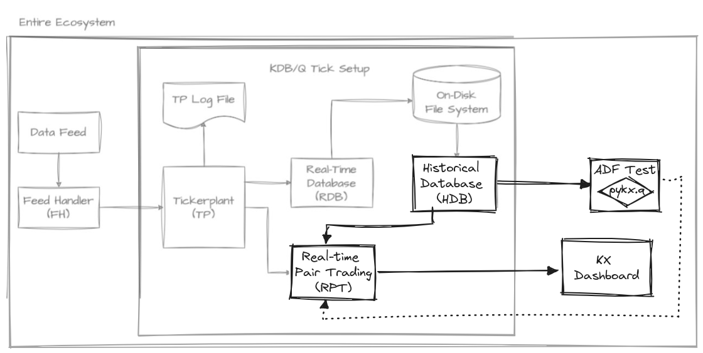
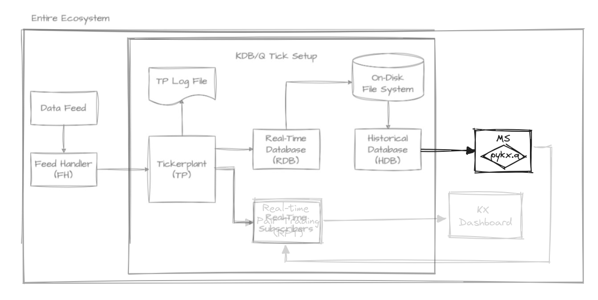
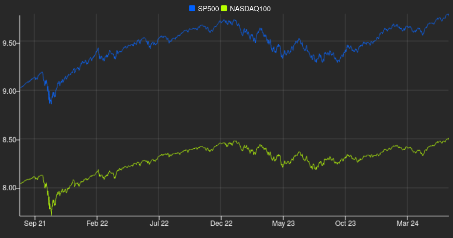
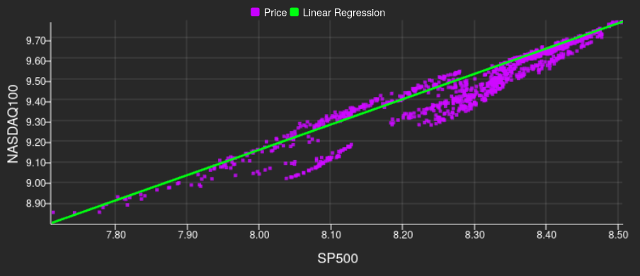
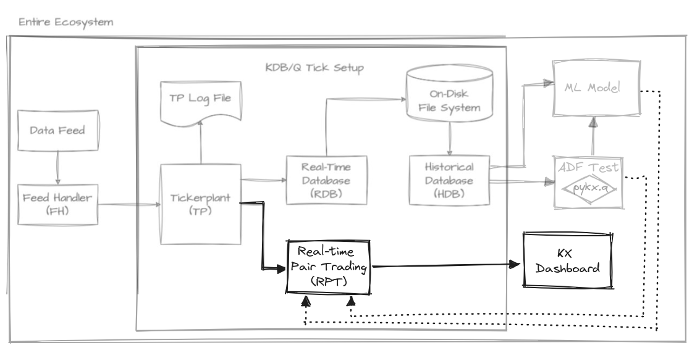
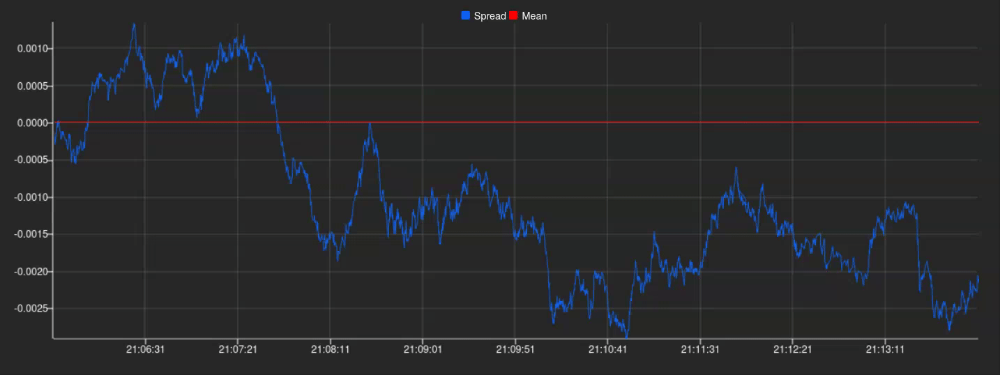
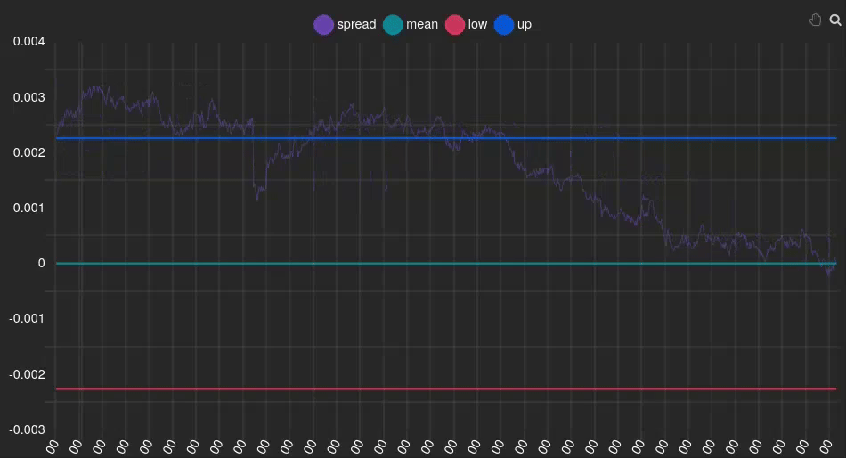

# Efficiency in Duality: Real-Time Pairs Trading Using kdb+/q

kdb+/q stands out as **a powerful tool in finance**, renowned for its ability to handle vast volumes of real-time data amidst the relentless dynamics of the market. In this article, we embark on an insightful exploration of [_Pairs Trading_](https://en.wikipedia.org/wiki/Pairs_trade), one of the most popular strategies in the trading world, and its implementation in q. Our primary goal is to demonstrate how straightforward it is to create a simple real-time implementation of this strategy. We accomplish this by leveraging the language's conciseness and expressiveness, along with reusing typical patterns and tools from the kdb ecosystems.

In order to achieve this, we have outlined the following steps:
* Identifying related indexes
* Implementing a model to calculate their spreads
* Visualizing the approach in real-time

We will use the [_Tick Architecture_](https://github.com/KxSystems/kdb-tick), the typical setup found in kdb+ systems, to introduce, contextualize and guide each step. As we acknowledge that the typical reader is a quant interested in learning the virtues of q, a concise introduction to this architecture will be provided. We have also aimed to briefly introduce pairs trading so that other developers can follow and benefit from this text. Please, feel free to skip the following section if you are familiar with it.

## What is Pairs Trading?

The market has often been described as a **stochastic** (a term which essentially means random) **process** where prices fluctuate irregularly. However, amidst this apparent randomness, we observe that **certain assets move in tandem** due to their inherent relationships. 

For instance, it's logical to expect that if the prices of petrol rise, the prices of cars should also rise. This is because auto companies rely on petrol for their operations, indicating an interconnectedness between the two. Over the long run, they tend to follow similar trends, **reflecting their underlying relationship**.

The pairs trading technique leverages this phenomenon by identifying two assets whose prices exhibit a stable relationship over time. When these prices deviate from their historical relationship, a trading opportunity arises. This strategy involves buying the undervalued asset (the one that has fallen more than expected) and selling the overvalued asset (the one that has risen more than expected). The expectation is that the prices will eventually revert to their mean, allowing the trader to profit from this convergence.

This market-neutral approach is particularly attractive because it doesn't rely on the overall market direction. Instead, it focuses on the relative performance of the paired assets, which can provide consistent returns even in volatile market conditions. By maintaining both long and short positions, pairs trading inherently hedges market risk, which can enhance portfolio stability and reduce exposure to broad market movements.

Before diving into this search for related pairs, let me introduce you the tick architecture.

## What is the Tick Architecture?

The tick architecture can be seen as a series of interconnected q processes commonly used to handle high-frequency trading data very efficiently. At its heart is the tickerplant (TP), a crucial component responsible for receiving and timestamping incoming data, then broadcasting it to other components such as the real-time database (RDB). The TP ensures that data is distributed in a timely manner, allowing for real-time analytics and decision-making. The RDB stores recent data for quick access, while the historical database (HDB) archives older data for long-term storage and analysis. Additionally, the feed handler plays a vital role by interfacing with external data sources, making sure that the TP receives accurate and up-to-date information. This architecture guarantees seamless data flow and rapid access to both real-time and historical data, making it ideal for high-frequency trading applications. In fact, this simple setup can process [large amounts of data in a very short time](https://kx.com/blog/what-makes-time-series-database-kdb-so-fast/) with a small memory footprint.


*kdb tick architecture [diagram by Alexander Unterrainer](https://www.defconq.tech/docs/architecture/plain), extended by us for this scenario.*

To develop the pairs trading strategy, we have integrated several new components into the default vanilla architecture. These include the Model Server (MS), Real-time Pairs Trading (RPT), and KX Dashboard, which will be introduced as needed. Now, let's begin our journey with the first step: identifying the most suitable pairs.

> 📚 If you are still curious about this topic, you can check out the new [kdb+ architecture course](https://learninghub.kx.com/courses/kdb-architecture/) at the KX Academy by Michaela Woods. If you want to go down to the metal, Alexander Unterrainer does an excellent job dissecting all the components, line by line, in his [KDB Tick Explained](https://www.defconq.tech/docs/tutorials/tick) series.

## Identifying cointegrated indexes

The pairs trading strategy relies heavily on identifying pairs of assets that maintain a long-term equilibrium relationship as mentioned previously.

Is this described mathematically? **Yes**:

The concept we're referring to is **cointegration** (although there are other methods, we'll focus on this one).

> 💡 Which should not be confused with correlation; cointegration is a statistical property of two-time series, indicating a long-term relationship between them despite short-term fluctuations. Cointegrated series move together over time, sharing a common stochastic drift. On the other hand, correlation measures the strength and direction of the linear relationship between two variables at a specific point in time. While correlation captures the degree of association between variables, cointegration reflects a deeper, underlying relationship that persists over time.

Hence, we're interested in **cointegrated assets**, which are assets that exhibit the following characteristics:
* They have a similar trend, meaning the difference between both assets maintains a constant mean, and this difference fluctuates around that same mean.
* This inherent relationship remains constant in the long run, indicating that the connection between the series is time-invariant.

Let's shift our focus to the MS component, which has several responsibilities. In this section, we'll concentrate on its first task: reading data from the HDB and calculating the degree of cointegration among existing pairs. This step is crucial as it lays the foundation for subsequent actions in the strategy. How should we go about implementing this process?



If our objective is to analyze potential pairs for the strategy using index data and their corresponding prices, querying the HDB for this information is a sensible approach. Assuming the HDB maintains a _stock_ table with the closing prices of each index for every date, we can employ the following query to retrieve all closing prices from the last `x` days:
```q
rs:{select close by sym from stock where date within(.z.d-x;.z.d)}
```
As you can see, the query resembles SQL: _select closing price by symbol from the stock table where the date is in the range between x days ago and today_. Indeed, we are taking advantage of the q-SQL syntactic facilities, which enable newcomers to be productive quickly, as evidenced by the [KX Academy](https://learninghub.kx.com/courses/kdb-developer-level-1/). It is worth mentioning that the query is enclosed in curly brackets, indicating that it is actually a function taking `x` as a parameter. The function is named `rs` to signify that it (r)eads (s)tocks.

> 💡 Using short names for variables is a standard convention that, once you get used to it, improves readability.

Now that we have defined a query, we need to execute it on the HDB component. To do so, we use [interprocess communication](https://code.kx.com/q/basics/ipc/) (IPC) to send the query:
```q
hdb:`$":",.z.x 0
cls:hdb(rs;2*365)
```
The first line reads the first value from the command line argument, where the HDB port is expected, and then produces the symbol `::PORT`, which refers to _localhost_ at the given _PORT_. Then, we supply the `rs` query along with its argument to define the range (two years ago from now), send them to HDB and assign the result generated by it to the `cls` variable:
```
sym      | close                                                             ..
---------| ------------------------------------------------------------------..
BFX      | 3746.07  3726.25  3682.07  3663.02  3711.71  3768.53  3785.46  377..
FCHI     | 6086.02  6031.48  5922.86  5794.96  5912.38  6006.7   6033.13  599..
GDAXI    | 13231.82 13003.35 12783.77 12401.2  12594.52 12843.22 13015.23 128..
HSI      | 22418.97 21996.89 21859.79 21853.07 21586.66 21643.58 21725.78 211..
N225     | 27049.47 26804.6  26393.04 26423.47 26107.65 26490.53 26517.19 268..
NASDAQ100| 11637.77 11658.26 11503.72 11779.9  11852.59 12109.05 12125.69 118..
NYA      | 14667.32 14599.59 14487.64 14499.49 14465.29 14676.5  14642.33 145..
RUT      | 1738.84  1719.37  1707.99  1741.33  1727.55  1769.6   1769.36  173..
SP500    | 3821.55  3818.83  3785.38  3831.39  3845.08  3902.62  3899.38  385..
STOXX    | 416.19   413.42   407.2    400.68   407.34   415.01   417.12   415..
```

> 💡 This approach exemplifies a good practice in kdb+: _keeping computations as close to the data as possible_. Instead of requesting data and then applying a filter or transformation to it, we send the computation to the HDB itself so we avoid transmitting unnecessary data over the communication.

Once we have collected the prices, it is useful to identify all possible pairs:
```q
syms:exec sym from cls
ps:sx where (<).' sx:syms cross syms
```
The first line extracts the sym column from the table. The second line generates their Cartesian product (`cross`) and filters out duplicate and inverse pairs by selecting only those pairs `where` the first element is alphabetically less than the second, ensuring each combination is unique. We are now ready to start analysing the cointegration of our pairs.

To assess the level of cointegration between our chosen pair of assets, we'll employ a statistical test. This test will help us quantify the strength of the long-term equilibrium relationship we're looking for in our pairs trading strategy. The cointegration test is a **hypothesis test**, where we use our data to evaluate a specific hypothesis. In this case, our null hypothesis is that the two time series are not cointegrated. To interpret the results of this test, we'll be focusing on **p-values**.

P-values help us decide whether to reject the null hypothesis. If the p-value is low, it suggests that we can reject the hypothesis of no cointegration, indicating that our assets are likely cointegrated. The lower the p-value, the stronger the evidence for cointegration. Conventionally, a threshold of 0.05 is often used for the p-value to reject the null hypothesis.

For the sake of simplicity, we will be using [PyKX](https://code.kx.com/pykx/2.4/index.html). This is necessary as we require importing our cointegration test function and plotting a heatmap of our results. Developing these functionalities directly in q would be time-consuming and prone to errors. Although an implementation of the cointegration test in kdb+/q would be more efficient and faster, the effort required would outweigh the benefits for this particular case where performance isn't critical. Therefore, we rely on PyKX to streamline the process by leveraging relevant libraries from the Python ecosystem.
```q
system"l pykx.q"
```
One such library is **statsmodels**, a prominent tool in Python for statistical modeling and hypothesis testing. It equips analysts with a robust toolkit for regression, time series, and multivariate analysis. Specifically, within the statsmodels package, the _statsmodels.tsa.stattools_ module features the Cointegration test.
```q
co:.pykx.import[`statsmodels.tsa.stattools]`:coint
```
We can proceed to create a function called `cof` to call our imported function from PyKX and return the second element from the resulting list, which in this case is the p-value, [as described in the official documentation](https://www.statsmodels.org/stable/generated/statsmodels.tsa.stattools.coint.html).
```q
cof:@[;1]co[<]::
```
Next, we will get the prices involved in each pair and use the function above to produce the desired p-values:
```q
pv:cof .'({x`close}')cls([]sym:ps)
```
The implementation details are not as important as illustrating the concision and terseness achieved when developing code in q.

Now, with our p-values in hand, let's show another example of the virtues of PyKX by plotting a heatmap, using the _seaborn_ library:
```q
pyhm:.pykx.import[`seaborn]`:heatmap
mx:flip("f"$1,'not null reverse m),'m:(0,sums[reverse 1_til count[syms]])_ pv
pyhm[mx;`xticklabels pykw syms;`yticklabels pykw syms;`cmap pykw `RdYlGn_r]
pysh:.pykx.import[`matplotlib.pyplot]`:show
pysh[::]
```
After importing the library utility and arranging the p-values into a matrix `mx` (filled with dummy values in the top right) we produce the heatmap and show it:


We will draw our attention to the synergy between _FCHI_ and _GDAXI_. They exhibit a vibrant green color, indicative of a high degree of cointegration, or, in simpler terms, a very low probability of not being related. They demonstrate the lowest p-value, suggesting their strength as candidates. The next graph consolidates this intuition:



The plotted graph displays the prices of both indexes together, providing a clearer comparison that showcases the cointegration between them. The blue and green lines represent GDAXI and FCHI, respectively. The close alignment of their price movements indicates that they are cointegrated to some extent. This means that, despite short-term deviations, the indexes tend to move together over time, maintaining a stable relationship. This graph was generated by [KX Dashboard](https://code.kx.com/dashboards/), which receives data from the Pairs Trading process and renders visualizations; we'll use this tool again later on.

As mentioned earlier, the market is inherently random and doesn't always behave predictably. While FCHI and GDAXI often follow similar trends, their individual values can sometimes diverge significantly. For instance, FCHI may rise while GDAXI falls, or vice versa. However, this presents **an opportunity for profit** because we know that these assets tend to revert to their shared mean over time. If one asset is _overpriced_ and likely to decrease, we may consider selling it (going short). Conversely, if an asset is _underpriced_ and expected to increase, we may consider buying it (going long). That is actually the essence of Pairs Trading.

> 💡 This strategy possesses financial characteristics: our _profitability remains unaffected by the broader market trends_, as our focus lies solely on the disparity between the two assets. It's about relative movements rather than absolute ones; we're indifferent to whether prices are rising or falling. This quality defines it as a neutral market strategy.

As you might guess, our next task is to build the model that helps us determine whether an index is actually overpriced or underpriced.

## Determining how to calculate the spreads

Having identified the optimal pair of indices for our pairs trading strategy, let's now explore how to deploy a simple model that detects trading opportunities. Additionally, we'll examine how all of this fits within the MS (Model Server) component.


At this point, we can start coding the actual pairs trading model that calculates the relationships between the prices of our indexes, which we'll refer to as **spreads**. Our initial approach might simply involve subtracting the prices and observing whether the difference deviates significantly from zero, taking their scale difference into account.

Indeed, just subtracting the prices of two assets, as in $price_y−price_x$ may not provide a clear understanding of their relationship. Let's illustrate this with an example:

```q
q)price_x: 5 10 7 4 8
q)price_y: 23 30 25 30 35
q)spreads: price_y - price_x
18 20 18 26 27
```

**These spread values don't offer much insight** into the relationship between the two assets. Are both assets increasing? Are they moving in opposite directions? It's unclear from these numbers alone.

Let's consider **using logarithms**, as they possess favourable properties for our pricing model. They prevent negative values and stabilize variance. Log returns are time-additive and symmetric, simplifying the calculation and analysis of returns. This improves the accuracy of statistical models and ensures non-negative pricing, enhancing model robustness and reliability:

```q
q)log price_x
1.609438 2.302585 1.94591 1.386294 2.079442
q)log price_y
3.135494 3.401197 3.218876 3.401197 3.555348
q)spreads: log[price_y] - log price_x
1.526056 1.098612 1.272966 2.014903 1.475907
```

We're making progress, as we observe **numbers now fluctuating within much smaller ranges**. However, we're still missing a clear understanding of the underlying relationship. While we've normalized the data using logarithms, we now need to align their discrepancies to a single asset. 

Since both assets are related, **we can leverage linear regression** to our advantage. This enables us to simplify our spreads effectively. So, we'll conduct a basic linear regression analysis using historical data to discern the disparity between them. The generic formulae for one is:

$$Y = \alpha + \beta X + \varepsilon$$

In this context, Y represents the FCHI index, X represents the GDAXI index, α is the intercept, β is the slope (which indicates the relationship strength between the two indexes), and ε is the error term. We illustrate it in the next graph:



As you can see, it shows the relationship between both indexes, with each purple dot representing a data point of their prices at a given time. The linear trend visible in the scatter plot suggests a strong positive cointegration between the two indexes. By applying linear regression, we can model this relationship mathematically, allowing us to predict the FCHI index price based on the GDAXI one. This predictive power is crucial for pairs trading, as it helps identify mispricings and potential trading opportunities.

Linear regression aims to identify relationships between historical data, which we then extrapolate to current data. The differences between these relationships, or deviations, are our spreads. We've already calculated the 𝛼 and 𝛽 using the logarithmic values of our historical data (since real-time price values for price_x and price_y are unknown). Now, we simply combine everything and apply linear regression to our price logarithms:

$$spread = log(price_y) - (\beta \cdot log(price_x)+\alpha)$$

```q
q)spreads: log[price_y] - alpha + log[price_x] * beta
-0.1493929 0.0451223 -0.08835117 0.0451223 0.1579725
```

To find the best relationship between our pair of assets in a pairs trading strategy, we need to determine the optimal values of alpha and beta that minimize the spread. In mathematical terms, we're looking for the line that best fits the prices. The most common approach to this problem is the least squares method, let's see how can we approach this problem.

Firstly, we can rewrite the linear regression equation as a matrix product:

```math
Y = (\alpha, \beta)\begin{pmatrix}1 \\ X\end{pmatrix}
```

Where α represents the intercept and β the slope of our regression line $Y = α + βX$.

In kdb+/q, we can efficiently solve this equation using the `lsq` (least squares) operator. Here's a compact function that computes the linear regression coefficients:

```q
lrf:{first enlist[y]lsq x xexp/:0 1}
```

This function works by creating a column vector [1, X] using a trick with `xexp`, then applying the `lsq` operator to solve the least squares problem. It leverages q's vectorized operations and built-in least squares solver to efficiently compute the regression coefficients.

Now, let's encapsulate the linear regression fitting and spread calculation processes. This will provide an interface that other components can use to fit a linear regression and calculate spreads.

First, to encapsulate the **linear regression fitting**, we'll develop a function called `ab`. This function takes a pair of indices as input, retrieves data from the `cls` table (which we used in the cointegration test), and uses the `lrf` function to obtain the linear regression parameters. The implementation would look like this:

```q
ab:{lrf . log(cls([]sym:x))`close}
```

Next, we'll encapsulate the **spread calculation**. We'll create a function that takes a pair of indices and returns another function. This returned function will expect the prices of `x` and `y` as inputs and calculate the spread. Leveraging q's conciseness, we can implement this as follows:

```q
sm:{[a;b;x;y]y-a+b*x}. ab@
```

The result is a powerful and concise interface for fitting linear regressions and calculating spreads, which can be easily used by other components in our system.

> 💡 As you may have noticed, this idea could be generalized and expanded to create a full-fledged model server. This server could host a variety of models, ranging from simple ones like linear regression to more complex models, making them accessible to other components. It could also include additional functions that would transform it into a powerful tool in the context of algorithmic trading and financial systems.

This precisely meets one of our objectives: getting **a comprehensive method for representing relative changes between both assets**. As we can deduce, our mean is now 0 because our assets are normalized, cointegrated and on the same scale. Therefore, ideally, the differential between their prices should be 0. Consequently, when our spread is below 0, we infer that asset X is overpriced, whereas if it's above 0, then asset Y is overpriced.

## Real-time spread calculation

Now that we have selected a pair of cointegrated indexes and built a model to calculate their relationships, it's time to formalize its subscription as a real-time component. Once we start receiving data from the TP, we can use the model to produce the spreads, which will then be sent to the dashboard, as illustrated in the diagram.



The first step in implementing this component is to retrieve the most cointegrated pair and its associated model. As we did before, we use IPC to communicate with the MS component:
```q
(ix;sp):ms({enlist[ix],sm ix:ps pv?min pv};::)
```
Here, we assume that `ms` points to the MS component (similar to how `hdb` was used in a previous section), and we send a query for MS to execute. It calculates the most cointegrated pair by finding the minimum p-value, identifying its position, and using it to find the names of the indexes. Finally, it executes the `sm` function obtained from the previous section to get the spread model for the most cointegrated pair. As a result, we get both the pair of indexes (`ix`) and the spread model (`sp`).

Real-time components can manifest their interest in a particular table and a subset of symbols. Naturally, we are only interested in getting quotes associated with one of the indexes in our `ix` pair:
```q
tp"(.u.sub[`quote;",(.Q.s1 ix),"])"
```
As usual, we assume that `tp` is a pointer to the TP process. Essentially, `.u.sub` registers the RPT handle in the TP so it can later notify the recently subscribed component about new events. It assumes that the subscriber has defined an `upd` function as a kind of callback:
```q
d:ix!2#0f
upd:{d^:exec sym!log(ask+bid)%2 from select by sym from y}
```
Our `upd` function takes ticks as input (`y`), selects the most recent one for each symbol, calculates their mid price, and updates the values (if any) in a simple dictionary `d`. This dictionary acts as a cache, which becomes essential in the following and final step.

Now we need to notify the KX Dashboard about the spreads. The dashboard subscribes to the RPT using the same interface that the RPT uses to subscribe to the TP (.u.sub). However, in this case, the dashboard makes this task automatic and transparent to the user by invoking this function once a dashboard element has selected the `spread` table from the RPT process as its data source. With this setup, we can publish events to our subscribers using `.u.pub`:
```q
.z.ts:{.u.pub[`spread;([]time:1#.z.N;spread:sp . d ix)]}
\t 16
```
As shown, we wrap this publication as part of a `.z.ts` function. This function is special because it can invoked automatically by setting a value for `\t`. In this case, we instruct kdb to publish the last seen spread from `d` every 16 ms. Why 16 ms? Because this allows the dashboard to update at a rate of ~60 frames per second, as illustrated in the [Streaming section](https://code.kx.com/dashboards/datasources/#streaming) from the KX Dashboard documentation.

> 📚 We highly recommend reading [Building real-time tick subscribers](https://code.kx.com/q/wp/rt-tick/) by Nathan Perrem before building your own real-time components.

By embracing this approach, it only remains to connect KX Dashboards to our publisher by setting up a new connection from the connection selector in the UI. This will allow us to plot our spreads in real time and we will end up with something like this:



And there we have it! A perfectly plotted spread series in real-time, ready to be utilized for further analysis and exploitation.

Up until this point in this section, we have taken a look at how we, having previously identified a pair of compatible assets, could reliably calculate a meaningful spread and implemented it in a simulated real-time scenario. Thanks to KX Dashboards we were also able to create a simple plot to show all this information in a way that's easily understandable.

To finish, once we have our spreads accurately calculated and observe how our data is being updated we can **execute buy and sell orders when spread discrepancies occur** based on some signal windows. A simple approach to window signals is to set these windows as twice the historical standard deviation of the spreads. Therefore, if either of these limits is reached, we should sell the overvalued index and buy the undervalued one, and then unwind our position when the spread returns to 0. Let's clarify this with a specific example:



In this instance, we can see that the spread (purple line) is positive and above the signal (blue line), indicating that our Y index (GDAXI) is overvalued relative to the FCHI. Therefore, we should sell GDAXI and buy FCHI. At the end of the animation, it can be observed that the spread returns to 0 (green line), meaning the indexes are no longer overvalued or undervalued, respectively. At this point, we should unwind the positions we acquired earlier.

> 💡 Signal windows play a pivotal role in implementing Pairs Trading strategies. They serve as indicators for determining when to execute buy and sell actions, acting as arbitrary thresholds that guide our algorithm's decision-making process. These windows are derived from the variance of our data, representing a static variance assumption due to our consideration of a time-independent cointegrated series.

As you can imagine, by taking advantage of the flexibility of the Tick architecture and the Kx Dashboard, what we have set up for two indexes could be implemented for all pairs of indexes that exhibit some cointegration without losing performance.

## Conclusion

This post has demonstrated that implementing a simple Pairs Trading strategy in kdb+/q is straightforward.

The primary enabler of this simplicity is the Tick Architecture, a robust design pattern that allows us to handle historical and real-time data with ease. We observed this in action while retrieving HDB data through the MS to calculate the spread models, and while subscribing the RPT to the TP to get the most up-to-date ticks. As we have seen, IPC is at the heart of this architecture and is essential for integrating new components into the system.

Secondly, the kdb ecosystem provides excellent tools, such as KX Dashboard, which we utilized to produce several graphs, particularly emphasizing real-time visualizations. As a niche platform, kdb cannot compete with Python in terms of ecosystem variety. However, PyKX allows us to overcome this limitation by enabling interaction with the Python ecosystem. This opens up possibilities for leveraging libraries like statsmodels and seaborn, as demonstrated in our examples.

Last but not least, the concision and expressiveness of q is impressive. We only needed to extend the vanilla architecture with less than 40 lines of q code to implement the MS and RPT components. In our view, maintaining 40 lines of code is far preferable to maintaining 400 lines. While becoming proficient with this language takes time, you don't need to master it to start analyzing data. q-SQL is a great entry point for beginners.

However, there are several other benefits of this landscape that we couldn't explore in this article.

Namely, the performance of these technologies is superb, both in terms of speed and memory footprint. In fact, as stated by KX in one of the articles linked above, kdb+ supports a throughput of 35K ticks per second for a single node. If we scale the solution to several nodes, we should easily accommodate thousands of pairs in the system simultaneously. We leave scaling this solution up as future work.

Additionally, one of the killer features of this platform is flexibility. We showed a bit of it while extending the architecture with our own components, but we could go further. For example, we could produce more accurate models by embracing the Kalman Filter to dynamically fit the coefficients of the linear regression. This would allow for real-time adjustments and provide a more accurate reflection of current market conditions. We could also delve deeper into the topic of window signals to provide a robust framework for effective trading strategies. Analyzing the complexity of integrating these changes, and more generally analyzing the evolvability of the system, is also left as future work.

We hope you enjoyed reading this article! You can find the whole code associated with this article in [this repository](https://github.com/hablapps/pt). Please feel free to experiment with it and extend it in any way. Feedback is more than welcome!

## Acknowledgements

We wish to express our sincere gratitude to Álvaro Sánchez-Paniagua Ríos for initiating the development and research process of this post; we greatly appreciate the foundational work he established. Furthermore, we extend our deepest thanks to Javier Sabio for introducing us to the topic of pairs trading and generously providing the initial documentation that facilitated our further exploration and development of this subject matter.

## References and Documentation

For the technical implementation, we relied on:

* Kx Documentation: https://code.kx.com/q/ref/
* Q for mortals: https://code.kx.com/q4m3/
* PyKX Documentation: https://code.kx.com/pykx/2.4/index.html
* statsmodels Documentation: https://www.statsmodels.org/dev/generated/statsmodels.tsa.stattools.coint.html

For the financial implementation, we used:

* QuantResearch: https://github.com/QuantConnect/Research/blob/master/Analysis/02%20Kalman%20Filter%20Based%20Pairs%20Trading.ipynb

For the data gathering, we used:
* Yahoo Finance API: https://github.com/ranaroussi/yfinance
* Tickstory: https://tickstory.com/

